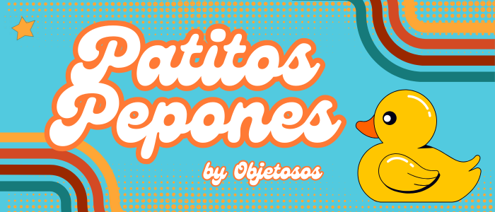
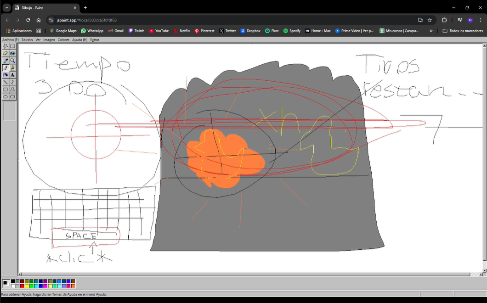

# Patitos Pepones

## Equipo de desarrollo

- Carlino Isla Luca Manuel
- Calzon Fabrizio Ernesto
- Figueroa Florencia Belen
- Gómez Melina
- Lozano Malena
- Paz Amelie

## Capturas

-Diseño conceptual

## Reglas de Juego / Instrucciones

-El jugador debe derribar todos los patitos dentro del tiempo dado y sin que se le terminen las balas. Para eso debe presionar la tecla "espacio" o "barra espaciadora" cuando el puntero esté sobre un patito.

-El juego cuenta con un cofre el cual proporciona balas extras al jugador asi como un reloj el cual agrega unos segundos extras al temporizador, ambos se mueven junto con los patitos en el nivel 1.

-Este puntero va a estar en constante movimiento de un punto del puesto de feria a otro, pasando sobre todos los patitos.

## Otros

- Universidad Nacional De Hurlingham
- Comisión 4 - Primer Cuatrimestre 2025
- Carreras: Tecnicatura Universitaria en Programación de Videojuegos y Tecnicatura Universitaria en Programación
- Versión de wollok: 0.3.1
- Una vez terminado, no tenemos problemas en que el repositorio sea público 
